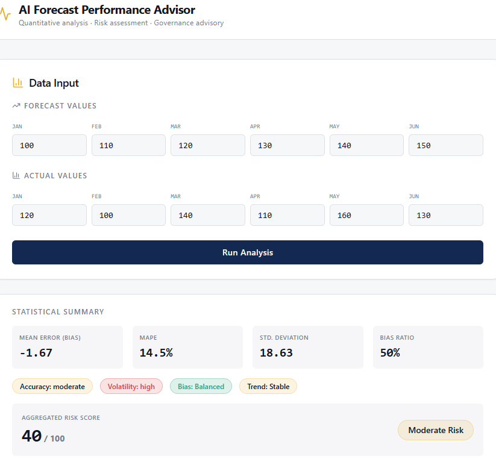
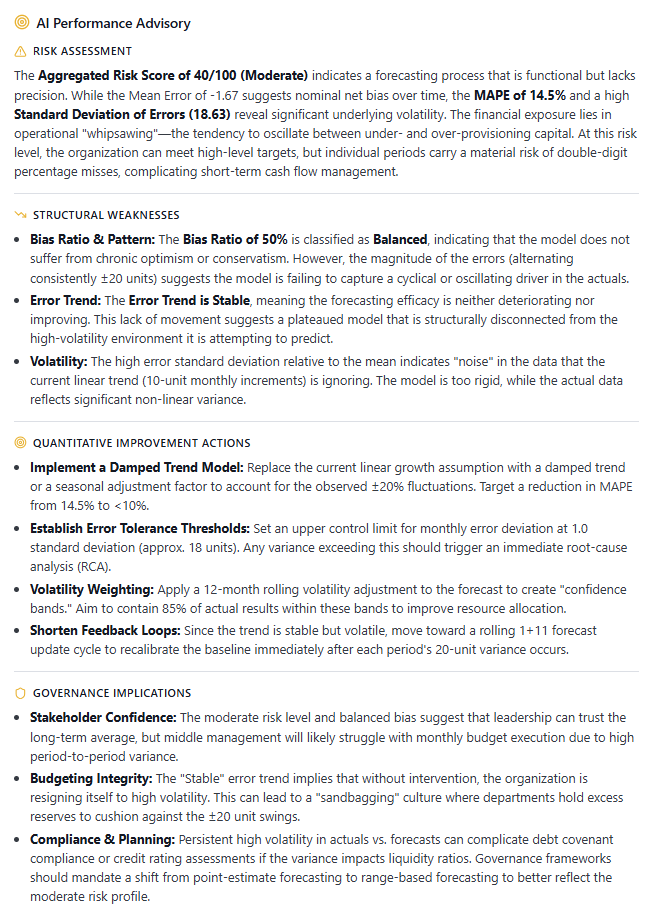

# AI Forecast Performance Advisor

AI Forecast Performance Advisor is a lightweight analytics tool designed to evaluate the reliability of financial forecasts.

The tool combines statistical diagnostics with AI-generated insights to analyze forecast accuracy, bias patterns, and potential forecasting risks.

---

## Key Diagnostics

- Forecast accuracy (MAPE)
- Mean Error (Bias)
- Forecast volatility
- Bias Ratio classification
- Error Trend detection
- Aggregated Forecast Risk Score
- AI-generated advisory insights

---

## Example Interface

---

## AI Advisory Example

---

## Project Purpose

Many organizations produce financial forecasts but lack tools to evaluate the reliability of the forecasting process itself.

This project aims to provide a diagnostic layer that helps identify:

- structural forecasting bias
- deteriorating forecast performance
- volatility in forecast accuracy
- governance risks related to unreliable forecasts

---

## Planned Improvements

- Forecast Reactivity indicator
- Forecast vs Actual visualization
- Confidence interval estimation
- Monte Carlo scenario testing
